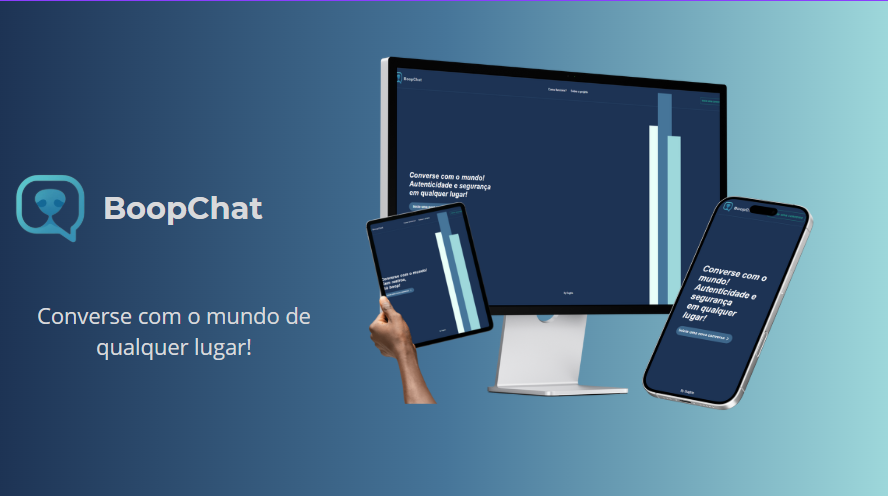

<p align="center">
  
</p>

<h1 align="center">BoopChat</h1>

<p align="center">
  Um aplicativo de chat em tempo real desenvolvido com Flask<br/>
  <strong>Simples, rápido e seguro!</strong> <br>
  **OBS:** O projeto é somente um protótipo, ou seja não está em produção logo para testar acesse localmente
</p>

---

## 🚀 Funcionalidades

✨ **Envio e recebimento de mensagens em tempo real**  
👥 **Suporte a múltiplos usuários simultâneos**  
🗂️ **Armazenamento de mensagens em banco de dados SQLite**  
🌐 **Interface web responsiva com HTML, CSS e JavaScript**

---

## 🛠️ Tecnologias Utilizadas
&nbsp;
&nbsp;
&nbsp;
&nbsp;
&nbsp;

---

## 📦 Instalação

1. **Clone o repositório:**

   ```bash
   git clone https://github.com/ryanpabloac/boopchat.git
   cd boopchat
